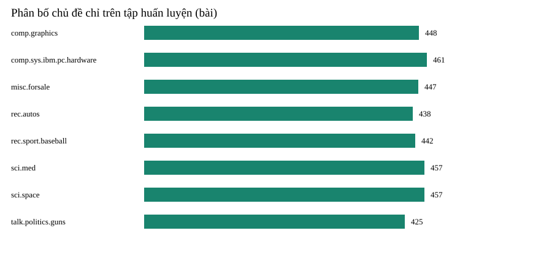

# Công cụ tìm kiếm bài viết theo nội dung bằng TF–IDF và cosine

Tài liệu nguồn biên tập cho báo cáo học phần. Bản DOCX/PDF được tạo từ kết quả thực nghiệm trong `ketqua.json`. Các mục tên nhóm, giảng viên và nhật ký tuần cần nhóm điền theo thực tế trước khi nộp.

## Tóm tắt

Nhóm xây dựng một công cụ truy hồi văn bản trên 8 nhóm của 20 Newsgroups. Mỗi bài đăng là một tài liệu trong kho; người dùng nhập truy vấn ngắn, hệ thống trả về các tài liệu có điểm cosine cao nhất. Từ vựng TF–IDF chỉ được học từ tập train khi chọn cấu hình. Mô hình phục vụ chỉ fit trên train sau khi chốt tham số; test theo ngày của bộ dữ liệu chỉ dùng để kết luận. Baseline đếm số từ khóa xuất hiện trong mỗi tài liệu.

Kết quả chạy ngày 02/10/2026: 7.801 bài thuộc 8 chủ đề được đọc; 353 bài quá ngắn và 24 bản trùng bị loại, còn 3.575 train, 896 validation, 2.953 test. Trên 200 truy vấn rút từ test, TF–IDF đạt Precision@5 0,457 và MRR 0,665; baseline đạt Precision@5 0,274. Đây là đánh giá theo nhãn chủ đề, chưa phải chấm liên quan thủ công cho từng bài.

Hệ thống bao gồm backend Python và frontend React/TypeScript tách riêng khỏi nghiệp vụ phòng khám: một API ở `be/HocMayBE` và một web React ở `fe/HocMayFE`. Script chuẩn bị dữ liệu tải bản gốc, kiểm tra checksum, làm sạch, chia tập, rồi lưu dữ liệu đã xử lý. Script huấn luyện thử bốn cấu hình TF–IDF cùng baseline; cấu hình được chọn dựa trên validation trước khi đánh giá test. API chỉ tải chỉ mục đã lưu, tính vector truy vấn và trả những bài có điểm dương. Giao diện hiển thị điểm cosine dạng số thập phân, đoạn trích và các token đóng góp; điểm số không được trình bày như xác suất đúng.

Kết quả trả lời câu hỏi nghiên cứu trong phạm vi tập dữ liệu này: TF–IDF vượt baseline trên Precision@5 và MRR, thời gian tính điểm thấp khi chỉ mục đã ở bộ nhớ. Chúng tôi không suy rộng kết quả sang bài viết y tế tiếng Việt hoặc cho rằng phương pháp hiểu nghĩa sâu. Giá trị của bài tập là một quy trình có thể tái lập từ dữ liệu thô đến web, trong đó lựa chọn mô hình và phép đánh giá được tách rõ. Phần lớn rủi ro còn lại nằm ở cách định nghĩa mức liên quan và tính phù hợp của dữ liệu nguồn.

## Câu hỏi nghiên cứu

TF–IDF kết hợp cosine có xếp bài viết cùng chủ đề cao hơn baseline trùng từ và đáp ứng đủ nhanh để phục vụ API web trên một kho văn bản nhỏ hay không? Hai tiêu chí được chốt trước khi xem test là Precision@5, MRR và thời gian đáp ứng. Tài liệu cùng chủ đề được xem là liên quan trong phép đo; đây là giả định có giới hạn vì một chủ đề vẫn có nhiều câu hỏi khác nhau.

Đơn vị quan sát là một bài đăng đã làm sạch. Tại thời điểm tìm kiếm, hệ thống biết văn bản của kho train, từ vựng TF–IDF, IDF và truy vấn người dùng. Nhãn chủ đề không tham gia tính điểm; nhãn chỉ xuất hiện trong tệp đánh giá. Đầu ra của một yêu cầu là danh sách nhiều nhất K bài với ID, chủ đề phục vụ bộ lọc, điểm cosine, đoạn trích và các token có tích trọng số lớn nhất. Trường chủ đề trong API là metadata của tập demo, không phải dự đoán của mô hình. Hệ thống từ chối giá trị K ngoài 1–50 và truy vấn trống để tránh xử lý không xác định.

Chúng tôi phân biệt ba loại câu hỏi. Thứ nhất, bài toán sản phẩm là tài liệu nào nên nằm trong trang kết quả đầu tiên. Thứ hai, bài toán thực nghiệm là TF–IDF có thay đổi thứ tự tốt hơn việc đếm từ hay không. Thứ ba, bài toán kỹ thuật là ứng dụng có trả lời nhanh và báo lỗi rõ khi thiếu mô hình hay nhập sai hay không. Precision@5 phản ánh tỷ lệ bài cùng chủ đề trong năm vị trí đầu; MRR phản ánh bài cùng chủ đề đầu tiên xuất hiện sớm hay muộn. Thời gian được đo trong tiến trình tìm kiếm sau khi đã nạp chỉ mục, vì vậy không đại diện cho độ trễ của mạng và trình duyệt.

Tiêu chí thành công tối thiểu là script chạy lại được trên máy khác, không có lỗi fit từ vựng trên validation/test, API trả kết quả có thể giải thích, và có so sánh công bằng với baseline. Nếu TF–IDF không vượt baseline, nhóm vẫn phải trình bày nguyên nhân và sai số; không được thay đổi tập test để đạt kết quả đẹp hơn. Ở lần chạy hiện tại, mô hình vượt baseline nhưng đánh giá còn hạn chế bởi nhãn mức chủ đề. Một truy vấn như “space shuttle launch” có thể liên quan nhiều bài sci.space, trong khi một bài cùng sci.space nói về hành tinh vẫn có thể không giúp người dùng.

## Dữ liệu và sử dụng

Nguồn là bản 20news-bydate được scikit-learn dùng. Backend viết bằng Python, sử dụng fetch_20newsgroups của scikit-learn với remove=('headers','footers','quotes'); frontend dùng React/TypeScript. Tám chủ đề gồm đồ họa, phần cứng PC, rao bán, ô tô, bóng chày, y học, không gian và chính sách súng. Đây là bài đăng lịch sử bằng tiếng Anh, không phải nội dung của phòng khám. Dữ liệu thô và nội dung cá nhân không được đưa vào Git.

Dữ liệu được tải bằng fetch_20newsgroups của scikit-learn; loader tải từ nguồn công bố và xác thực checksum theo mã nguồn thư viện. Phiên bản scikit-learn và dấu vân tay của dữ liệu đã xử lý được lưu cùng báo cáo chất lượng. Cách làm này giảm khả năng vô tình chạy thí nghiệm trên một bản dữ liệu khác. Loader dùng bộ nhớ đệm trong `dulieu/tho` cho các lần chạy sau. Đường dẫn dữ liệu không chứa thư mục cá nhân cố định, nên người khác có thể tái tạo trên máy có Python 3.12 và các thư viện trong `thuvien.txt`.

Chọn tám chủ đề tạo đủ độ đa dạng để thử sự nhầm lẫn giữa các lĩnh vực mà vẫn giữ chi phí huấn luyện phù hợp với một máy cá nhân. Các nhóm khoa học như `sci.med` và `sci.space` có nhiều từ chuyên môn khác nhau; `comp.graphics` và `comp.sys.ibm.pc.hardware` có thể chia sẻ từ “computer”; `misc.forsale` dễ chứa nhiều tên hàng; chủ đề chính sách súng có thể dùng từ trùng với câu chuyện xã hội ở nhóm khác. Đây là lý do hợp lý để phân tích lỗi theo nhóm, nhưng không có nghĩa tám nhóm này đại diện cho toàn bộ 20 nhóm. Bộ 20 nhóm gốc có 18.846 bài; chỉ số 7.801 trong báo cáo là số bài thuộc tám nhóm được chọn trước bước làm sạch.

Thông tin trên trang scikit-learn mô tả dữ liệu và cách tải nhưng không tự động cấp quyền công bố lại mọi bài đăng. Repo chỉ giữ script tải và metadata nguồn; bản gốc cùng văn bản xử lý được bỏ khỏi Git. Nếu trưng bày công khai bản demo, người vận hành cần xem lại điều khoản nguồn và rà soát bài viết có thông tin cá nhân hoặc nội dung gây hại. Lớp web chỉ hiển thị đoạn trích, trong khi API cũng giới hạn số kết quả. Với bài toán phòng khám, kho dữ liệu cần được thay hoàn toàn bằng nội dung do phòng khám sở hữu hoặc có quyền sử dụng.

## Chất lượng và rò rỉ thông tin

Header có thể chứa chủ đề, email, tên tổ chức hoặc máy chủ và tạo lối tắt cho tìm kiếm. Script loại đoạn header, dòng trích dẫn, chữ ký, email và URL trước khi chia đánh giá. Quy tắc làm sạch được cố định bằng code, không học từ nhãn. Sau chia, bài dưới 40 ký tự bị loại; bản trùng theo SHA-256 của nội dung đã chuẩn hóa được bỏ xuyên split. Chúng tôi không dùng nhãn chủ đề để fit vectorizer.

Trích dẫn trong bài trả lời có thể lặp nội dung đã thấy ở train. Loader scikit-learn bỏ headers, footers và quotes; bước làm sạch tiếp tục che email, URL và số điện thoại. Quy tắc này được cố định trước khi fit từ vựng và không bảo đảm ẩn danh toàn bộ tên riêng trong nội dung.

Báo cáo chất lượng được viết sau mỗi lần `python chaylenh.py chuanbi`. Trong lần chạy Python ngày 02/10/2026, có 7.801 bài thuộc tám chủ đề; 353 bài dưới 40 ký tự và 24 bản trùng bị loại sau khi làm sạch, còn 7.424 bài. Báo cáo `dulieu/xuly/chatluong.json` ghi ID và lý do cho từng bài bị loại. Ưu tiên giữ bài train rồi validation rồi test khi loại trùng xuyên split.

Kiểm tra chất lượng còn cần hiểu giới hạn của phép đo này. Hash chỉ phát hiện bản sao khớp toàn bộ sau chuẩn hóa hiện tại; văn bản thay một câu có thể vẫn gần như trùng. Nội dung sau làm sạch có thể còn tên riêng hoặc dữ liệu nhạy cảm ở dạng không giống email. Phân bố lớp nhìn chung gần cân bằng nhưng không bằng nhau: `talk.politics.guns` còn ít bài nhất, còn `sci.med` nhiều hơn. Chênh lệch đó có thể tác động tới số kết quả cùng chủ đề sẵn có trong chỉ mục. Chúng tôi không cân bằng lại bằng cách nhân bản bài vì thao tác ấy có thể làm sai đánh giá truy hồi.

## Phân chia dữ liệu

Train/test gốc là phân chia theo ngày của 20 Newsgroups. Validation lấy 20% từ train gốc theo từng chủ đề với seed 42. Khi chọn cấu hình, từ vựng và IDF chỉ được fit từ train; truy vấn validation là tài liệu chưa xuất hiện trong chỉ mục. Sau khi chọn, mô hình phục vụ tiếp tục dùng từ vựng và IDF chỉ học trên train để giữ ranh giới đánh giá. Các kiểm thử xác nhận từ chỉ xuất hiện ngoài train không đi vào từ vựng.

Trình tự rất quan trọng: trước tiên xác định bài nào thuộc từng split, sau đó áp dụng quy tắc làm sạch đã chốt và dedupe xuyên split, cuối cùng mới fit thống kê từ vựng. Trong lúc thử tham số, train gồm 3.575 bài. Validation gồm 896 bài, nhưng để giữ thời gian đánh giá và cân bằng các nhóm, script lấy 25 bài theo hash ID cố định của mỗi nhóm, tổng 200 truy vấn. Từ mỗi bài validation, script lấy 18 token đầu đã chuẩn hóa làm truy vấn ngắn. Chỉ mục lúc này không chứa bài validation, nên truy vấn không tự tìm thấy chính nó. Cách tạo truy vấn này rẻ và có thể lặp lại, nhưng 18 token đầu không luôn diễn đạt ý chính của bài.

Tập test by-date còn 2.953 bài sau lọc. Cấu hình được chọn hoàn toàn trên validation; model phục vụ và toàn bộ ma trận TF–IDF được fit từ 3.575 bài train. Bước đánh giá cuối lấy 25 bài test mỗi chủ đề theo hash ID cố định để tạo 200 truy vấn. Dấu vân tay của dữ liệu và cấu hình được lưu trong kết quả; chạy lại với cùng model trả kết quả test đã lưu thay vì đo test lần nữa.

Rò rỉ cũng có thể xuất hiện qua thao tác tưởng chừng vô hại như lập danh sách stopword riêng từ toàn bộ tài liệu trước khi chia, chọn nhóm từ dựa trên điểm test, hoặc đọc các câu test để viết truy vấn manual sát với chúng. Phiên bản hiện tại không làm các bước đó: tokenizer là biểu thức cố định, không học stopword từ corpus; danh sách 32 truy vấn tự viết trong tệp độc lập; số liệu test chỉ được sinh bởi lệnh evaluate sau khi có cấu hình chọn ở validation. Kiểm thử tự động còn tạo một token chỉ có ở dữ liệu ngoài train và xác nhận token ấy không lọt vào từ vựng.

Biểu đồ EDA chỉ dùng train: các nhóm gần cân bằng nên validation được chia phân tầng, không nhân bản bài.

## Phương pháp

Baseline hạ chữ và đếm số từ truy vấn khác nhau có trong bài, mỗi từ tính một lần. Mô hình chính dùng TfidfVectorizer của scikit-learn với IDF trơn `log((1+N)/(1+df))+1`, chuẩn hóa L2. Cosine là tích vô hướng giữa vector truy vấn và vector tài liệu; ma trận sparse được lưu trong artifact để tìm kiếm sau huấn luyện.

Mỗi tài liệu sau khi làm sạch được tách thành token bằng cùng một quy tắc dùng cho truy vấn. Những token xuất hiện trong quá ít bài bị loại bởi `minDf`, còn token quá phổ biến bị loại bởi `maxDf`. Tần suất tài liệu `df` được đếm đúng một lần cho mỗi bài, dù từ xuất hiện lặp lại trong bài đó. IDF trơn đảm bảo từ có trong toàn bộ kho vẫn có trọng số hữu hạn. Trọng số TF–IDF của từ trong tài liệu là tích giữa số lần xuất hiện và IDF. Sau chuẩn hóa L2, một bài dài không thắng chỉ vì chứa nhiều từ hơn. Nếu mọi token đều bị lọc, vector rỗng và hệ thống trả danh sách rỗng thay vì bịa điểm.

Sau khi fit trên train, Pipeline lưu từ vựng, IDF và ma trận TF–IDF sparse. Một truy vấn được biến đổi bằng chính Pipeline đã lưu rồi nhân với ma trận tài liệu để lấy điểm cosine. Chỉ bài có điểm dương được xếp hạng; điểm hòa được sắp ổn định theo ID. API không fit hoặc tính lại IDF trên mỗi yêu cầu.

Baseline nhận cùng chuỗi truy vấn đã chuẩn hóa. Mỗi từ truy vấn khác nhau được cộng một điểm nếu xuất hiện trong bài. Cách này có thể ưu tiên bài chứa nhiều từ truy vấn nhưng không phân biệt từ đặc trưng với từ rất phổ biến; bài lặp một từ nhiều lần cũng không được lợi. Baseline vẫn có ích vì đơn giản, dễ diễn giải và cho biết liệu trọng số IDF cùng chuẩn hóa có thực sự đem lại cải thiện trong thí nghiệm hay không. Cả hai hệ thống dùng cùng kho chỉ mục ở từng split và cùng quy tắc gán nhãn liên quan khi tính metric.

Điểm cosine nằm trong khoảng 0–1 với vector không âm đã chuẩn hóa, nhưng không phải xác suất bài đúng. Một bài có điểm 0,56 chỉ có nghĩa hướng vector từ vựng của nó gần với hướng vector truy vấn hơn các bài có điểm thấp trong cùng chỉ mục. Giá trị tuyệt đối có thể thay đổi khi thêm tài liệu, đổi từ vựng hoặc thay độ dài truy vấn. Giao diện vì vậy hiển thị điểm thập phân cùng các token đóng góp lớn nhất để người dùng hiểu vì sao bài xuất hiện; hệ thống không dùng một ngưỡng điểm cố định để tuyên bố đúng hay sai.

## Thiết kế thí nghiệm

Các phương án dùng cùng train, cùng 200 truy vấn validation và cùng phép đo: baseline; unigram; unigram + bigram; giảm `minDf` từ 3 xuống 2; tăng `minDf` lên 5 và giảm `maxDf` xuống 0,85. Số chiều từ vựng được báo cùng điểm, tránh đánh đổi chất lượng lấy bộ từ vựng quá lớn mà không thấy chi phí. Chọn theo Precision@5, dùng MRR để phá hòa, sau đó ưu tiên mô hình nhỏ hơn.

Phép đo Precision@5 lấy năm kết quả đầu cho một truy vấn, đếm bao nhiêu bài có cùng nhãn chủ đề với bài truy vấn, rồi chia cho năm. Trung bình trên 200 truy vấn cho biết hiệu quả của trang kết quả đầu tiên. MRR lấy nghịch đảo vị trí của bài cùng chủ đề xuất hiện đầu tiên; nếu không có bài như vậy thì bằng 0. MRR nhấn mạnh vị trí đầu, còn Precision@5 phản ánh mật độ kết quả liên quan. Cả hai là metric tự động theo nhãn chủ đề, không thay được đánh giá từng cặp truy vấn–tài liệu của con người.

Validation và test đều dùng tối đa 25 bài mỗi chủ đề, chọn bằng hash ID cố định, tổng 200 truy vấn mỗi tập. Mỗi truy vấn là 18 token đầu của bài chưa có trong train. Precision@5 đếm bài cùng chủ đề trong năm vị trí đầu; MRR@10 xét vị trí bài cùng chủ đề đầu tiên trong mười vị trí đầu. Cùng split, cùng truy vấn và metric được dùng cho mọi cấu hình; test chỉ được đo sau khi chọn bằng validation.

Độ trễ được đo quanh lệnh tìm kiếm trong cùng tiến trình Python sau khi nạp model. Script chạy các truy vấn, lấy trung vị và phân vị 95 để tránh một vài truy vấn dài che mất hành vi thông thường. Kết quả không tính tải dữ liệu từ đĩa lúc khởi động, HTTP, proxy Vite, mạng hay trình duyệt. Vì thế số mili giây chỉ là bằng chứng rằng thuật toán tìm kiếm phù hợp quy mô demo; nó không phải cam kết vận hành trong hệ thống phòng khám. Máy, phiên bản Python và scikit-learn, tải hệ thống và kích thước chỉ mục có thể làm số này thay đổi.

## Truy vấn tự xây dựng

Tệp `dulieu/truyvantutao.json` có 32 câu truy vấn ngắn, bốn câu mỗi chủ đề. Mỗi câu có một chủ đề được gán là liên quan. MRR và Precision@5 được tính theo chủ đề của bài được trả về. Bộ câu này dễ hơn truy vấn rút từ bài test vì tác giả viết trực tiếp từ các từ khóa chủ đề; kết quả phải báo tách riêng, không dùng để thay điểm test. Để đánh giá ứng dụng thực tế, cần người chấm đọc từng kết quả và đánh dấu bài thực sự trả lời câu hỏi.

Ví dụ truy vấn thuộc chủ đề không gian nhắc đến chuyến bay và kính thiên văn; chủ đề y học hỏi về điều trị, triệu chứng hoặc nghiên cứu; chủ đề phần cứng PC hỏi linh kiện và cấu hình. Các câu được lưu riêng trong JSON với ID, câu chữ và nhãn dự kiến để người xem có thể đọc, sửa và mở rộng mà không thay thuật toán. Chúng không được sinh từ nội dung một tài liệu cụ thể và không dùng để fit IDF. Bốn câu mỗi lớp giúp phát hiện trường hợp một lớp chỉ tình cờ có một ví dụ tốt, dù số lượng vẫn nhỏ so với bộ đánh giá thực tế.

Điểm P@5 của bộ truy vấn thủ công là 0,850 và MRR là 0,948. Sự chênh lệch lớn so với test tự động là một phát hiện cần giải thích: câu tự viết thường chứa chính thuật ngữ phân biệt chủ đề, trong khi 18 token đầu của một bài đăng có thể là lời chào hoặc bối cảnh. Nếu chỉ công bố điểm 0,850, người xem sẽ đánh giá quá cao hệ thống. Chúng tôi giữ điểm này như phép kiểm tra giao diện và khả năng truy hồi câu hỏi rõ nghĩa; kết luận chính lấy từ split test độc lập với cấu hình.

Một bộ đánh giá sử dụng thật nên trích câu hỏi từ nhật ký tìm kiếm đã được phép dùng, sau đó cho ít nhất hai người đọc và chấm mức liên quan của từng kết quả. Bất đồng cần được lưu và giải quyết trước khi tính metric. Với bài y tế, câu trả lời vừa phải đúng chủ đề vừa phải chính xác, có nguồn và còn hiệu lực. Nhãn `sci.med` chỉ chỉ ra diễn đàn mà bài được đăng; nó không bảo đảm bài đó đáng tin cho bệnh nhân.

## Kết quả validation

Baseline đạt Precision@5 0,270. Unigram đạt 0,498 và đứng đầu. Unigram + bigram đạt 0,478; biến thể `minDf=2` đạt 0,478; biến thể `minDf=5`, `maxDf=0,85` đạt 0,459. Bigram làm tăng đáng kể số chiều nhưng không cải thiện điểm trên tập này. Vì vậy, mô hình unigram được chốt trước khi chạy test. Điểm manual query không dùng để đổi lựa chọn mô hình.

So với baseline, unigram tăng tuyệt đối 0,228 Precision@5 trên validation, tương đương 1,14 bài cùng chủ đề trong năm kết quả đầu mỗi truy vấn. Đây là chênh lệch trên bộ truy vấn được sinh từ 18 token đầu của bài validation; chưa có phép thử ý nghĩa thống kê và không suy rộng sang dữ liệu khác.

Biến thể `minDf=2` giữ nhiều từ hiếm hơn và tăng số chiều. Biến thể `minDf=5`, `maxDf=0,85` lọc mạnh hơn so với bigram cơ bản nhưng vẫn có nhiều chiều hơn unigram. Điểm validation lần lượt 0,478 và 0,459, thấp hơn unigram 0,498 trong thí nghiệm này; chúng không được chọn.

Unigram + bigram cũng thấp hơn unigram, dù về mặt ngôn ngữ có vẻ giàu biểu diễn hơn. Một lý do có thể là mỗi cụm hai từ chỉ xuất hiện ở ít bài, và truy vấn 18 token đầu không luôn lặp đúng cụm từ ở tài liệu phù hợp. Bigram còn làm mỗi tài liệu và truy vấn có nhiều đặc trưng, kéo theo chi phí lưu trữ và tính điểm. Thí nghiệm không chứng minh bigram luôn kém; nó chỉ cho thấy chưa có lý do chọn bigram cho chỉ mục và bộ câu hỏi hiện tại. Nếu đổi sang bài tiếng Việt, tách từ và cụm từ sẽ phải được thiết kế lại từ đầu.

## Kết quả test

Trên 200 truy vấn từ tài liệu test, unigram TF–IDF có Precision@5 0,457 và MRR 0,665. Baseline trùng từ đạt Precision@5 0,274 và MRR 0,491. Trung vị thời gian tìm kiếm là 29,9 ms, P95 44,9 ms trên môi trường thử nghiệm. Đây là thời gian trong hàm xếp hạng sau khi mô hình đã nạp; không gồm thời gian tải trang, mạng hoặc khởi động server. Không nên suy ra SLA production từ phép đo này.

Mức tăng tuyệt đối trên test là 0,183 Precision@5 và 0,174 MRR. Với cùng định nghĩa liên quan theo nhãn chủ đề, trung bình trong năm kết quả đầu có thêm khoảng 0,92 bài cùng chủ đề so với baseline. MRR 0,665 cho thấy bài cùng chủ đề đầu tiên thường xuất hiện khá sớm, nhưng giá trị trung bình che giấu các truy vấn không có kết quả phù hợp ở đầu. Bảng theo từng chủ đề trong phần phân tích lỗi giúp tránh diễn giải một con số chung như mức chất lượng đồng đều cho mọi lĩnh vực.

P@5 test 0,457 thấp hơn validation 0,498 đúng 0,041. Hai tập cùng nguồn 20 Newsgroups nhưng khác thời điểm trong split by-date; chênh lệch này là lý do cần báo cáo test độc lập, không thay tham số sau khi nhìn kết quả. Chất lượng trên câu hỏi thật hoặc tài liệu tiếng Việt cần đánh giá riêng.

Bộ 32 truy vấn tự xây đạt Precision@5 0,850 và MRR@10 0,948. Chúng thường chứa từ khóa đặc trưng cho từng chủ đề nên dễ hơn truy vấn lấy từ 18 token đầu bài test. Kết quả được báo riêng; phép đo tốc độ thuộc hàm tìm kiếm trên model train gồm 3.575 tài liệu và 11.858 từ vựng, không gồm HTTP hoặc trình duyệt.

## Phân tích lỗi

Nhóm sci.space có Precision@5 thấp nhất trên 25 truy vấn test của nhóm (0,352); rec.autos đạt 0,416. Truy vấn lấy từ 18 token đầu có thể chứa lời dẫn chung hoặc từ xuất hiện ở nhiều nhóm, khiến bài khác chủ đề đứng đầu. Sai số này là theo nhãn chủ đề; cần đọc từng cặp truy vấn và tài liệu để đánh giá mức liên quan thực tế.

Phân tích theo lớp được thực hiện trên cùng 25 truy vấn test mỗi lớp, nên một truy vấn thất bại có thể làm số trung bình lớp thay đổi đáng kể. Bóng chày là ví dụ: tên cầu thủ, đội bóng hoặc chuyện cá nhân ở đầu bài có thể hiếm gặp trong tài liệu khác, khiến vector truy vấn không kết nối rõ với nhãn `rec.sport.baseball`. Truy vấn tự động cũng có thể bắt đầu bằng lời dẫn chung trước khi văn bản nói đến trận đấu. Với `talk.politics.guns`, từ “law”, “right” hoặc “government” có thể xuất hiện trong nhiều chủ đề xã hội khác, còn từ đặc trưng nằm sâu hơn trong bài.

Một nhóm lỗi khác đến từ làm sạch. Loại dòng trích dẫn giảm rò rỉ, nhưng đôi khi phần trích dẫn lại chứa câu hỏi chính, trong khi phần tác giả trả lời chỉ là “I agree” hoặc một lời nhận xét ngắn. Quy tắc cắt chữ ký có thể loại quá nhiều hoặc quá ít nếu văn bản dùng định dạng khác. Vấn đề này cần được giải quyết bằng cách xem các cặp truy vấn–kết quả sai, cải thiện parser, rồi kiểm thử trên một tập đánh giá mới. Không nên tinh chỉnh lại trên chính test hiện tại vì sẽ làm điểm test mất tính độc lập.

Điểm theo chủ đề không phát hiện các bài khác nhãn nhưng vẫn trả lời đúng câu hỏi. Ví dụ một câu về phần cứng dùng trong đồ họa có thể được giải đáp ở cả nhóm `comp.graphics` và `comp.sys.ibm.pc.hardware`; phép đo hiện tại vẫn xem một bên là sai. Ngược lại, một bài đúng nhãn nhưng không nói về truy vấn cụ thể sẽ được xem là đúng. Đây là lý do báo cáo dùng từ “cùng chủ đề” khi nói về metric, và đề xuất gắn nhãn mức bài bởi người đọc ở giai đoạn tiếp theo. Giao diện cũng không ẩn điểm thấp để người dùng có thể tự xem các kết quả gần nhất và nhận biết khi kho không có câu trả lời.

## Web và API

Backend Python FastAPI phục vụ `GET /api/search?q=&k=&category=`, `GET /api/meta`, `GET /api/evaluation`, `GET /api/health`. API kiểm tra độ dài truy vấn, số kết quả và chủ đề; trả 400 cho đầu vào sai, 503 khi chưa có mô hình. Frontend React có ba màn hình: giới thiệu/phạm vi, thao tác tìm kiếm và dashboard đánh giá. Trang kết quả cho thấy đoạn trích, điểm cosine, các token góp phần và thời gian đáp ứng. Backend chỉ nạp chỉ mục đã huấn luyện từ tệp, không fit trên mỗi request.

Luồng chạy bắt đầu bằng `python chaylenh.py toanbo` tại BE: loader scikit-learn tải và làm sạch, chia tập, thử bốn cấu hình, chọn bằng validation, lưu Pipeline và ma trận TF–IDF thưa, rồi đánh giá test cuối. FastAPI nạp artifact joblib lúc khởi động. Mỗi request được kiểm tra, vector hóa bằng từ vựng/IDF đã fit và nhân với ma trận thưa để tính cosine; không fit lại khi phục vụ. FE gọi API qua proxy Vite và hiển thị kết quả.

Giao diện tìm kiếm có trường nhập, bộ lọc tám chủ đề và lựa chọn số lượng kết quả. Mỗi thẻ kết quả có tiêu đề rút từ bài, tên nhóm, đoạn trích, điểm cosine và các từ góp phần. Giao diện hiển thị trạng thái đang tải, lỗi API, không có kết quả và kết quả thành công. Màn hình giới thiệu giải thích phạm vi dữ liệu cùng nguyên lý; màn hình đánh giá đưa các số liệu validation/test và một biểu đồ so sánh để người xem kiểm tra kết luận. Các thành phần dùng HTML có nhãn và điều hướng bằng bàn phím ở mức cơ bản. Điểm trình bày tới ba chữ số thập phân, có giải thích không phải xác suất.

API trả JSON và không yêu cầu đăng nhập vì đây là demo trên dữ liệu công khai. Đối với phòng khám thật, không nên mở endpoint này ra Internet trước khi có xác thực, giới hạn tốc độ và phân quyền theo loại tài liệu. Chỉ mục demo là một dịch vụ độc lập trong `be/HocMayBE`; chưa nối Gateway/Clinic Service để tránh làm thay đổi luồng bệnh án hiện tại. Điểm tích hợp hợp lý là Gateway chuyển tiếp yêu cầu tìm kiến thức y tế tới dịch vụ tìm kiếm, còn dữ liệu bệnh án cá nhân phải theo chính sách truy cập riêng. Cần thay corpus bằng các bài được duyệt, không dùng bài `sci.med` như lời khuyên điều trị.

## Đạo đức và giới hạn

20 Newsgroups gồm bài đăng của người thật, có thể chứa quan điểm lỗi thời, nội dung nhạy cảm và thông tin cá nhân. Pipeline bỏ email/header/đoạn trích dẫn và chỉ hiển thị đoạn ngắn, nhưng cần rà soát thêm nếu công bố rộng. Dữ liệu `sci.med` không phải nguồn y khoa được thẩm định. Điểm cosine là độ giống từ vựng, không phải xác suất đúng hoặc chẩn đoán. Chuyển sang phòng khám cần kho bài tiếng Việt do người có chuyên môn duyệt, thử nghiệm truy vấn tiếng Việt và cơ chế phân quyền nếu tìm trong tài liệu nội bộ.

Nguồn 20 Newsgroups được tạo từ thảo luận trên Internet thời kỳ trước; một số bài có thể có ngôn ngữ không phù hợp hoặc thông tin lỗi thời. Hệ thống tìm kiếm có thể vô tình làm nội dung đó nổi bật khi người dùng nhập truy vấn. Vì vậy, nếu trình bày công khai, nhóm nên giới hạn đối tượng truy cập, thêm hướng dẫn sử dụng và cơ chế báo cáo bài cần gỡ. Việc bỏ email, URL và số điện thoại ở snippet giảm một số trường hợp lộ dữ liệu nhưng không loại mọi tên người, địa chỉ hoặc câu chuyện cá nhân. Không được mô tả pipeline này là công cụ ẩn danh hoàn chỉnh.

Sai lệch trong dữ liệu ảnh hưởng trực tiếp thứ hạng. Các chủ đề được chọn có thể có lượng bài và cách viết khác nhau; những nhóm có nhiều thuật ngữ lặp lại sẽ dễ được TF–IDF nhận ra hơn. Cấu hình chọn theo điểm trung bình có thể tối ưu cho nhóm dễ và che khuất nhóm khó. Bảng P@5 theo từng nhóm là bước kiểm tra ban đầu; muốn ra quyết định sản phẩm cần phân tích thêm theo kiểu truy vấn, độ dài văn bản, ngôn ngữ và độ tin cậy nguồn. Việc lưu cấu hình cùng kết quả cho phép so sánh trung thực giữa các phiên bản mà không thay đổi định nghĩa metric sau khi xem kết quả.

Ứng dụng phòng khám đặt ra yêu cầu cao hơn nhiều: bài hướng dẫn phải được bác sĩ hoặc bộ phận chuyên môn duyệt, có ngày cập nhật, nguồn tham khảo, phạm vi đối tượng và quy trình thu hồi nội dung sai. Tìm kiếm chỉ giúp người dùng tới bài phù hợp; nó không chẩn đoán và không thay tư vấn cá nhân. Khi truy vấn nhắc triệu chứng hoặc thuốc, giao diện cần ngữ cảnh rõ để tránh người dùng hiểu điểm cosine là mức độ an toàn hay phù hợp điều trị. Việc tìm trong hồ sơ bệnh nhân còn đòi hỏi xác thực và ghi nhật ký truy cập trước khi đưa vào thực tế.

## Tái lập và bàn giao

Yêu cầu Python 3.12 và kết nối mạng lần tải đầu. Tại `be/HocMayBE`, tạo `.venv`, cài `thuvien.txt`, chạy `python chaylenh.py toanbo` rồi `python maychu.py`. Tại `fe/HocMayFE`, chạy `npm ci` và `npm run dev`. Pytest kiểm tra API, xếp hạng và ranh giới fit train; frontend chạy typecheck/build. Tên hai thành viên, phân công và nhật ký sáu tuần phải điền từ bằng chứng Git thực tế.

Người kiểm tra bắt đầu từ `huongdan.md` của hai module. Sau khi cài thư viện theo `thuvien.txt`, lệnh `python chaylenh.py toanbo` tải dữ liệu, sinh `dulieu/xuly/chatluong.json`, chọn cấu hình bằng validation, lưu `mohinh/botimkiem.joblib`, xuất `baocao/ketqua.json` và các biểu đồ SVG. Chạy pytest cho backend và build frontend, rồi thử truy vấn “space shuttle launch mission”. Độ trễ thay đổi theo máy; số split và metric lặp lại với cùng dữ liệu, seed và phiên bản thư viện.

Dữ liệu gốc, dữ liệu xử lý và artifact joblib có nội dung từ người đăng nên bị bỏ khỏi Git; script và chỉ dẫn tái tạo được giữ. Báo cáo lưu nguồn, phiên bản scikit-learn, dấu vân tay dữ liệu, ngày chạy và số đo. Demo BE/FE chạy riêng khỏi dịch vụ phòng khám và không đọc hồ sơ bệnh nhân.

Nhật ký tiến độ và phân công là bằng chứng hoạt động nhóm. Không có danh tính hoặc lịch sử đóng góp của hai thành viên trong dữ liệu cung cấp, nên mẫu `baocao/nhatkyphancong.md` để ô trống. Trước khi nộp, nhóm cần điền tên, mã sinh viên, commit/PR tương ứng và kê khai công cụ AI đã dùng theo thực tế.

## Kết luận

Với 8 chủ đề của 20 Newsgroups, TF–IDF unigram vượt baseline trùng từ trên Precision@5 của test và cho phản hồi nhanh trên máy thử nghiệm. Kết quả phù hợp mục tiêu một công cụ tìm kiếm nhỏ, minh bạch và không cần mô hình ngôn ngữ lớn. Hạn chế quan trọng là đánh giá cùng chủ đề thay cho mức liên quan từng bài và mô hình chỉ khớp từ vựng tiếng Anh. Trước khi đưa vào cổng bệnh nhân, cần dữ liệu được duyệt và đánh giá riêng cho tiếng Việt.

Bài tập bao gồm tải dữ liệu bằng loader có kiểm tra checksum, tách split, làm sạch, fit từ vựng chỉ trên train, chọn siêu tham số bằng validation, so sánh baseline, đánh giá test và phục vụ qua FastAPI. Artifact joblib giữ Pipeline và ma trận thưa để API không huấn luyện theo request. Kết quả unit test và truy vấn API mẫu xác nhận luồng chính hoạt động; độ trễ không gồm mạng và trình duyệt.

Hướng mở rộng có cơ sở là gắn nhãn liên quan mức từng bài, cải thiện cách sinh truy vấn đánh giá, thử BM25 và xử lý đồng nghĩa, sau đó kiểm chứng trên corpus tiếng Việt được phép sử dụng. Mỗi mở rộng phải giữ một tập kiểm thử mới độc lập để tránh tối ưu vào tập test đã đọc. Khi đưa vào kiến trúc phòng khám, dịch vụ tìm kiếm nên nhận bài kiến thức từ nguồn đã duyệt và cung cấp API qua Gateway; các tài liệu nội bộ chỉ được lập chỉ mục với kiểm soát quyền truy cập tương ứng. Những bước này nằm ngoài phạm vi kết quả thực nghiệm hiện tại.

## Tài liệu tham khảo

1. scikit-learn, “The 20 newsgroups text dataset”: https://scikit-learn.org/stable/datasets/real_world.html#the-20-newsgroups-text-dataset
2. scikit-learn, mã nguồn loader và checksum: https://github.com/scikit-learn/scikit-learn/blob/main/sklearn/datasets/_twenty_newsgroups.py
3. scikit-learn, “Text feature extraction”: https://scikit-learn.org/stable/modules/feature_extraction.html#text-feature-extraction
4. Tài liệu học phần, Bài 1 – Vector và độ tương đồng cosine (do giảng viên cung cấp).

## Phụ lục cần nhóm hoàn thiện

- Điền họ tên, mã sinh viên, lớp và phân công hai thành viên.
- Ghi nhật ký sáu tuần theo công việc thực tế; đối chiếu với commit và pull request.
- Ghi công cụ AI đã sử dụng và cách kiểm chứng kết quả theo yêu cầu học vụ.
- Thêm đánh giá thủ công mức từng bài nếu còn thời gian; giữ tập test độc lập với việc chọn tham số.
